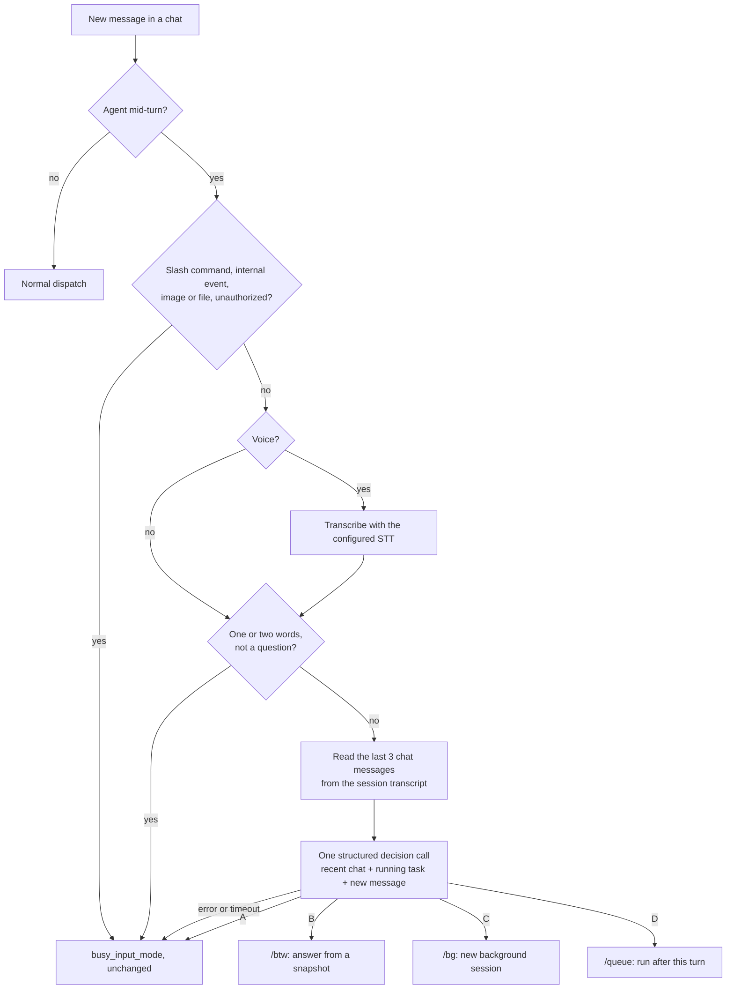
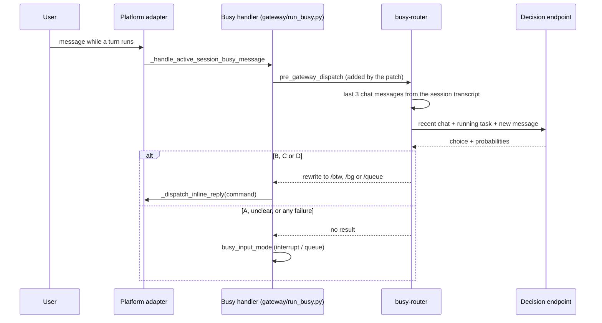

# busy-router

**Talk to a busy Hermes agent the way you would talk to a colleague.** Ask how it is going, hand it something unrelated, or line up the next step, and it keeps working on the task it already has.

busy-router is a [Hermes Agent](https://github.com/NousResearch/hermes-agent) gateway plugin. When a message arrives while the agent is mid-turn, the plugin makes one structured decision call that takes about 170 ms. The answer picks where the message goes:

- **A** (correction, constraint, stop): goes to the running task, handled by your `busy_input_mode`.
- **B** (quick question about progress or context): goes to `/btw`, answered from a snapshot while the work continues.
- **C** (new, unrelated task): goes to `/bg`, which starts its own background session.
- **D** (next step after the current one): goes to `/queue`, which runs when the turn ends.

Without it, every message sent during a long turn either interrupts the work or waits for it. Hermes already has `/btw`, `/bg` and `/queue`. busy-router picks one for you, including for voice messages.

## Contents

1. [How it works](#how-it-works)
2. [What it never does](#what-it-never-does)
3. [Install](#install)
4. [Configure](#configure)
5. [Patch your gateway](#patch-your-gateway)
6. [Instructions for agents applying this patch](#instructions-for-agents-applying-this-patch)
7. [Verify](#verify)
8. [Measured accuracy](#measured-accuracy)
9. [Repository layout](#repository-layout)
10. [License](#license)

## How it works



The classifier sees three things:

- the last 3 chat messages of the conversation: your messages and the agent's final replies, 300 characters each, with tool calls, tool output and gateway notices left out;
- the text of the running turn;
- the new message.

It returns a typed `choice` with a probability distribution over A to D, from any OpenAI-compatible endpoint that serves a Jev-style structured decision model (see [Jev Stage](https://github.com/GY19A/jev-stage) for the contract):

```json
{"answers": {"route": {"type": "choice", "choice": "B",
  "probabilities": {"A": 0.0012, "B": 0.9986, "C": 0.0001, "D": 0.0002}}}}
```

The plugin rewrites the message as `/btw <text>`, `/bg <text>` or `/queue <text>`. The gateway then dispatches it exactly as if the user had typed that command.

Where it sits inside the gateway:



The plugin also shortens the gateway's echoes for these commands to one line:

- `/bg` starts with "🔄 Background task started"; the result arrives under "✅ Background task done".
- `/btw` starts with "💬 btw"; the answer arrives as "💬 …".

It does this by registering a partial English locale, so it needs no core edit and no restart.

## What it never does

- **It never sends a correction away from the running task.** Label A, and anything that is not confidently B, C or D, reaches your existing `busy_input_mode`. In both evaluation sets, no correction was ever routed to `/bg` (gate: A→C = 0).
- **It never blocks a message.** Endpoint down, timeout, malformed answer, missing configuration: the message is handled as if the plugin were not installed.
- **It never touches idle chats, slash commands, images, files or internal events.**
- **It sends only the recent chat, the running task and the new message to your endpoint.** No tool output, no files, no credentials. Set `history_messages` to 0 to send only the last two.

## Install

Requirements: Hermes Agent with plugin support, a gateway you can restart once, and an OpenAI-compatible endpoint serving a structured decision model.

```bash
hermes plugins install GY19A/busy-router/busy-router --enable
```

Or copy the `busy-router/` folder into `~/.hermes/plugins/` and run `hermes plugins enable busy-router`.

The plugin loads without the gateway patch. In that state it only ever sees idle chats, where it does nothing. [Patch your gateway](#patch-your-gateway) to make it active.

## Configure

Settings live under the plugin's own entry in `~/.hermes/config.yaml`. Only the key itself goes in `~/.hermes/.env`.

```bash
hermes config set plugins.entries.busy-router.settings.endpoint https://your-router.example/v1/chat/completions
hermes config set plugins.entries.busy-router.settings.decision_model your-decision-model
hermes config set plugins.entries.busy-router.settings.api_key_env YOUR_ROUTER_API_KEY   # name of the env var, not the key
hermes config set plugins.entries.busy-router.settings.timeout_s 3.0
hermes config set plugins.entries.busy-router.settings.history_messages 3   # 0 disables chat history
```

```yaml
plugins:
  entries:
    busy-router:
      settings:
        endpoint: https://your-router.example/v1/chat/completions
        decision_model: your-decision-model
        api_key_env: YOUR_ROUTER_API_KEY
        timeout_s: 3.0
        history_messages: 3
```

Point it at the same API router your agent already uses, so you have one gateway, one key and one place to watch traffic. Settings are read on every call, so changes apply without a restart.

## Patch your gateway

Stock Hermes calls the `pre_gateway_dispatch` hook only when a chat is idle. A message that arrives mid-turn goes straight to the busy handler, and no plugin ever sees it. `gateway-patch/busy-path-pre-gateway-dispatch.patch` adds 19 lines to `gateway/run_busy.py`, in `_handle_active_session_busy_message`, after the internal-event check. The new code offers the message to the same hook:

- **No hook result:** the message falls through to `busy_input_mode` unchanged.
- **`skip`:** the message is dropped.
- **Rewritten to a slash command:** the command is dispatched inline, through the same path a typed `/btw` takes.

It changes nothing for installs that have no plugin using `pre_gateway_dispatch`.

```bash
cd ~/.hermes/hermes-agent        # the checkout your gateway actually runs; see step 1 below
git apply --check /path/to/busy-router/gateway-patch/busy-path-pre-gateway-dispatch.patch
git apply        /path/to/busy-router/gateway-patch/busy-path-pre-gateway-dispatch.patch
hermes gateway restart
```

The patch was generated against Hermes `39faafb` and applies cleanly to upstream `main` as of 2026-10-02. If `git apply --check` fails on a newer tree, use the instructions below. They describe the change by its anchors rather than by line numbers.

## Instructions for agents applying this patch

If you are a Hermes agent asked to install busy-router on your own gateway, follow these steps in order. Stop and report if any check fails.

1. **Find the code that is actually running.** Locate the gateway's `hermes-agent` checkout from the running process (`hermes gateway status`, or the gateway process's working directory). Do not assume `~/.hermes/hermes-agent` if more than one copy exists.
2. **Confirm the gap.** In `gateway/run_busy.py`, find `async def _handle_active_session_busy_message`. Confirm that it does not already call `_hm_pre_gateway_dispatch_hook`. If it does, upstream has fixed this; skip to step 5.
3. **Confirm the anchors exist.**
   - The block `if getattr(event, "internal", False):` inside that method.
   - `async def _hm_pre_gateway_dispatch_hook` in `gateway/run_inbound.py`.
   - `async def _dispatch_inline_reply` in `gateway/platforms/base.py`.
4. **Insert the block.** Put it immediately after the internal-event `return True`, and before the `busy_input_mode` handling. Copy it from `gateway-patch/busy-path-pre-gateway-dispatch.patch`. Keep the `_bot_loop_admitted = True` line: without it, a rewritten message is counted twice against the bot-loop budget.
5. **Run the contract test** in `tests/test_busy_path_dispatch_hook.py` against the patched tree. All 4 tests must pass. Then revert your edit and run it again: the rewrite and skip tests must fail. A test that passes on unpatched code proves nothing.
6. **Install, configure and enable the plugin** as above.
7. **Restart the gateway once,** at a moment when no other chat has a turn in flight. The patch is core code, so a plugin reload does not load it.
8. **Verify on live traffic.** See below. Then record the patch in your fork's patch ledger, so the next `hermes update` does not silently drop it.

## Verify

Logs, in `~/.hermes/logs/gateway.log`:

```
busy-router: registered
busy-router: chat=!room:server label=B -> btw p={'A': 0.001, 'B': 0.999, 'C': 0.0, 'D': 0.0} hist=3 214ms
busy-path plugin rewrite for session ... -> /btw
```

Live test. Start a long task, then send these while it runs:

- **"how far along are you?"** should come back as "💬 btw", then the answer. The task keeps running.
- **"also check tomorrow's weather in San Francisco"** should show "🔄 Background task started", and the result arrives later.
- **"after that, push it to the remote"** should run when the turn ends.
- **"no, the title must be in English"** should interrupt or queue, as your `busy_input_mode` decides.

To turn it off at once, without a restart: `hermes plugins disable busy-router`.

## Measured accuracy

All gates were fixed before any run: no correction routed to `/bg` (A→C = 0), and a clear margin over the control. Model: Jemma-4-int4 behind an OpenAI-compatible router. One call per message.

### Does chat history help?

To find out, we sampled 77 real messages, each sent while the agent was mid-turn, from 55 production conversations. Each message was labelled before any model ran, by a judge that could read the full context. Then three inputs were compared on the same model:

- **No history** (running task + new message):
  - strict accuracy 0.779; lenient 0.870, which also counts a defensible second route
  - 3 corrections sent to `/bg`
  - p50 170 ms
- **Last 3 messages:**
  - strict accuracy 0.831; lenient 0.909
  - 1 correction sent to `/bg`
  - p50 222 ms
- **Last 5 messages:**
  - strict accuracy 0.805; lenient 0.909
  - no correction sent to `/bg`, but more corrections answered as `/btw`
  - p50 244 ms

On real mid-turn traffic, about 80% of messages are corrections or additions to the running task. That makes "route nothing" a strong control: it scores 0.883 lenient. Without history, the router fell below that control. With 3 messages it beats it.

Three messages met the adoption rule fixed before the run: at least +5 points, and no more corrections sent to `/bg`. Five did not. History helps most with messages that only make sense against what was just said, such as "no, the other one" or "that's the file I meant earlier". Read alone, those look like a question or a new task. Versus no history, the 3-message arm fixed 7 messages and broke 3. That is suggestive, not statistically significant (McNemar p = 0.34); a larger run is the next step.

### Labelled sets

- **Real chat messages**, 50 labelled from a production room, mostly voice transcripts:
  - accuracy 0.96, against a majority-class control of 0.34
  - A→C = 0
  - p50 167 ms
- **Second set**, 45 written to cover each label:
  - accuracy 0.956, against a control of 0.31
  - A→C = 0
  - p50 164 ms
  - The D description was tightened once after this set's first run (0.933), so treat it as a development set, not held-out.
- **End to end**, through the real adapter busy path with the real plugin and endpoint: 5 of 5 routed correctly, including one voice message.

Remaining misses:

- A complaint phrased as a question ("so the tests still fail?") goes to `/btw`.
- A short imperative about a different service ("restart the staging server") stays with the running task.
- A follow-up conditioned on a sub-step ("when the build passes, send me the link") is read as a correction.

All three fail toward the running task or a read-only answer, never toward a new session.

All measured sets are messages from private chats, so they are not published. `eval/labels_example.jsonl` shows the format. Label 50 or more of your own messages the same way, then rerun the gate against your endpoint:

```bash
BUSY_ROUTER_ENDPOINT=https://your-router.example/v1/chat/completions \
BUSY_ROUTER_MODEL=your-decision-model BUSY_ROUTER_KEY_ENV=YOUR_ROUTER_API_KEY \
python eval/eval.py your_labels.jsonl results.json
```

## Repository layout

```
busy-router/                        the plugin (copy into ~/.hermes/plugins/)
  __init__.py                       hook, chat history, classifier call, short notices
  plugin.yaml                       manifest
gateway-patch/
  busy-path-pre-gateway-dispatch.patch   19-line core patch for gateway/run_busy.py
tests/
  test_busy_path_dispatch_hook.py   contract test for the patch (4 tests)
eval/
  eval.py                           offline gate against hand labels
  labels_example.jsonl              label format, one example per case
LICENSE
```

## License

BSD 2-Clause. See [LICENSE](LICENSE).

Copyright (c) 2026, Guang Yang (guang.yang@philab.fund), Phi Lab Foundation.
